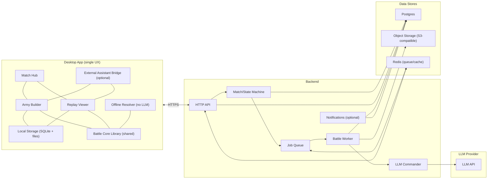
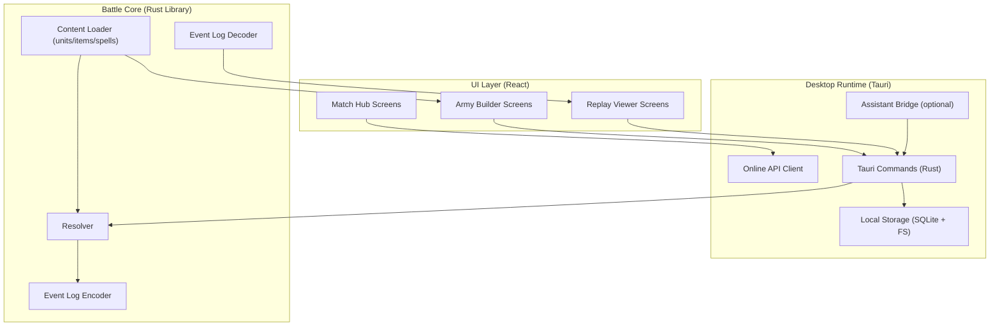
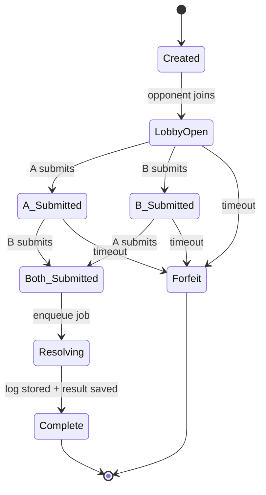
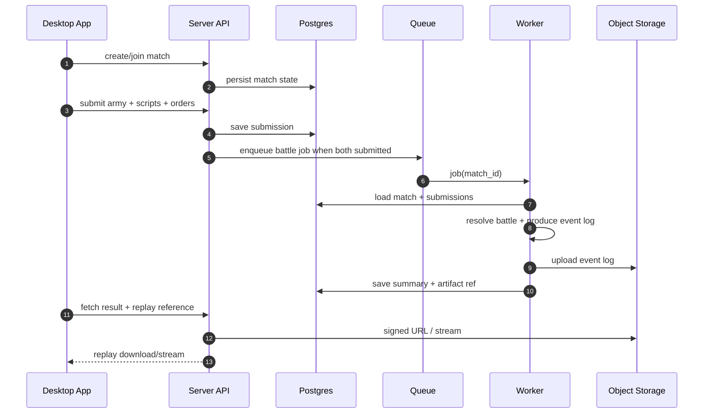

# Fantasy Autobattler (V1) — Architecture

**Document status:** Draft  
**Last updated:** 2026-02-02  
**Audience:** Project owner (human), multi-agent developers, future contributors

---

## 1. Purpose and scope

This document describes a pragmatic V1 architecture for a fantasy autobattler with:

- Tick-based battle resolution producing an **authoritative event log**
- **Deterministic replay playback** from the event log (no re-simulation in the viewer)
- **Asynchronous multiplayer** (submit independently → server resolves)
- Optional, server-side **LLM Commander** that interprets player orders and intervenes at bounded points
- A **Desktop Application** that contains both **Army Building** and **Replay Viewing** in one cohesive UX
- Optional **External Assistant integration** (MCP) useful for development and power users

V1 assumes modest load (e.g., ≤ ~1k battles/day at launch), so the deployment can be intentionally simple while retaining clean boundaries.

---

## 2. Core requirements (V1)

### Functional
- Two factions in V1 (Humans, Orcs), data-driven roster
- Point-buy army building
- Deployment placement inside zones
- Squad scripting (troops: stance + target priority; heroes: opening actions + conditions + default behavior)
- Battle resolution:
  - supports ~2000 total combatants
  - seeded RNG for deterministic testing
  - event log output
- Replay:
  - play/pause/seek/speed/step
  - unit inspection
  - battle summary
  - visibility into LLM Commander decisions (summaries + patches)
- Multiplayer async:
  - match creation/join
  - submission
  - resolve when both submitted
  - replay retrieval

### Non-functional
- Deterministic log order: stable `(tick, seq)` ordering
- Performance: battle worker must complete typical battles quickly enough for async UX
- Logs must be compact enough to store/share
- The desktop app must render 2000 units + projectiles smoothly (with placeholder art first)

---

## 3. High-level system overview

### Components

- **Desktop App** (single application):
  - Match Hub (browse/pending/results)
  - Army Builder (roster, upgrades, scripts, placement)
  - Replay Viewer (event-log playback)
  - Local storage (saves, cached replays)
  - Optional External Assistant bridge (dev-mode / power-user)
  - Offline resolver (same sim core, Commander disabled)

- **Backend** (server):
  - API (auth, match lifecycle, replay access)
  - Battle Worker (authoritative resolution + log generation)
  - LLM Commander module/service (invoked by worker)
  - Notification (email optional for V1)
  - Postgres + object storage + Redis (queue/caching)

### System diagram

---

## 4. Desktop App architecture (subsystems)

The Desktop App is the primary product surface: users build armies and watch replays in one cohesive UX.

### 4.1 Subsystems

1. **Match Hub**
   - Login/identity UI (online mode)
   - Match list (pending / ready to watch / history)
   - Create/Join/Challenge (V1 can be friend-only)

2. **Army Builder**
   - Data-driven roster browser
   - Point budget accounting + validation
   - Squad purchase + upgrades
   - Hero equipment + empowerment + gems
   - Placement editor (deployment zones)
   - Scripting editor (troop + hero)
   - Commander orders UI (optional toggle)
   - Submit to server (online) or Run locally (offline)

3. **Replay Viewer**
   - Load event log (local cache or streamed download)
   - Playback controls (play/pause/seek/speed/step)
   - Timeline markers (kills, routs, commander interventions)
   - Unit inspection (tile list, hero finder)
   - Battle summary

4. **Local Storage**
   - SQLite for:
     - saved armies/templates
     - local match metadata
     - cached replay index + pointers to files
   - Filesystem cache for:
     - replay logs (compressed)
     - art assets (sprite atlases, audio)

5. **External Assistant Bridge (optional)**
   - Dev-mode harness for automated playtesting:
     - generate armies
     - run local battles
     - export replays
     - run bulk simulations and summarize outcomes
   - Power-user mode (optional) for army-building assistance via MCP

6. **Offline Resolver**
   - Runs the same battle core locally
   - Commander disabled (or mock deterministic commander)
   - Produces event logs that are replayable in the same viewer

### 4.2 Desktop internal diagram

**Key principle:** keep game logic out of UI components. UI calls Tauri commands, which invoke the shared core (resolver/log codecs/content) and storage.

---

## 5. Battle resolution design (shared core)

### 5.1 Resolver loop

Although the design uses “ticks,” the implementation should avoid scanning all units every tick. Instead:

- Maintain time-indexed schedules:
  - next unit action tick
  - projectile impact tick
  - effect expiration tick
- Advance to the next tick where something occurs (“jump to next event tick”)
- Within a tick, resolve deterministically:
  1. impacts + expirations
  2. unit actions (stable order: unit_id)
  3. commander intervention (if triggered at this tick)

This preserves the “tick” abstraction while scaling better.

### 5.2 Determinism

- Seeded PRNG for all non-LLM randomness
- Stable ordering: events are `(tick, seq)` in emission order
- Event log is the authoritative record

**Testing mode:** a mock commander can be deterministic to allow reproducible results end-to-end.

---

## 6. Event log format and replay

### 6.1 Goals
- Compact
- Streamable (don’t require full log in memory)
- Versioned and forwards-tolerant (within reason)

### 6.2 Recommended format (V1)
- Protobuf messages (schema)
- Length-delimited streaming file
- Compression: zstd
- Optional index chunk for fast seeking

### 6.3 Replay principles
- The replayer does **not** run resolver logic
- It reconstructs render state by applying events sequentially
- Any “derived” state (HP bars, effects) must be derivable from events alone

---

## 7. Backend architecture (V1)

### 7.1 Keep it simple at launch
Given expected low battle volume, a minimal deployment can be:

- 1× API service (includes match state machine)
- 1× Worker service (battle jobs)
- Postgres
- Redis (queue)
- Object storage (event logs)

You can run API + Worker on small instances and scale workers horizontally if needed later.

### 7.2 Match state machine

### 7.3 Online flow sequence

---

## 8. Auth and identity (V1)

Auth is required for online async multiplayer but can be minimal:

- **Passwordless email code/magic link** is simplest for early alpha.
- Store user identity in Postgres:
  - `users(id, email, created_at, ...)`
  - sessions/tokens as needed
- All match participation is keyed by user_id.

Offline mode requires no auth.

---

## 9. LLM Commander architecture (bounded)

### 9.1 Two-phase model

1) **Pre-battle interpretation (1 call per side)**
- Input: player orders + roster + allowed script primitives
- Output:
  - initial scripts
  - adaptation rules (what triggers interventions)
  - human-readable summary
- Logged in event log (`CommanderOrdersReceived`, `CommanderInterpretation`)

2) **During battle interventions (bounded)**
- Triggered by:
  - cadence (every N ticks)
  - events (e.g., “archers threatened”, “immunity observed”)
  - strict budget (e.g., 3 interventions per side)
- Output: structured script patches only (not free-form commands)
- Logged as `CommanderIntervention` with:
  - trigger
  - patch summary
  - brief reasoning text for replay

### 9.2 Failure behavior
If the commander call fails (timeout, invalid output):
- Continue with existing scripts
- Log a commander error event (optional)

---

## 10. External Assistant (MCP) integration

### 10.1 Dev harness (recommended early)
Use MCP to let development agents “playtest” programmatically:
- query roster and stats
- construct armies
- configure scripts
- run local battles (offline)
- batch simulate (e.g., 100 runs) and summarize

### 10.2 Security and release policy
- Default: dev tools disabled in public builds
- Alpha/beta: behind an explicit “Developer Mode” flag
- Never expose opponent data or active-battle control via the assistant

---

## 11. Data model (high level)

### Tables (suggested)
- `users`
- `matches`
- `match_players`
- `submissions`
- `battle_artifacts` (event log ref + schema versions)
- `notifications` (optional)

### Storage
- Postgres: metadata and state
- Object storage: event logs, optional replay previews

---

## 12. Tech stack recommendation (V1)

### Desktop App
- Tauri (Rust backend) + React/TypeScript frontend
- Renderer: PixiJS (WebGL 2D) for sprites/projectiles
- Audio: Web Audio API + simple asset pipeline
- Local persistence: SQLite + filesystem cache

### Shared core
- Rust crates:
  - `battle_core` (resolver)
  - `battle_formats` (event log schema + codecs)
  - `content` (data loaders)

### Backend
- Rust (Axum) API and Worker
- Postgres
- Redis queue
- S3-compatible object storage
- Email service (optional for V1)

---

## 13. CI/CD (summary; details in Roadmap doc)

- PR CI: lint/format/tests + determinism “golden log” checks
- Nightly builds:
  - desktop artifacts per OS
  - optional dev-mode assistant bridge included
- Tagged releases:
  - signed/notarized builds for external testers
- Backend:
  - container build + deploy
  - migrations validated in CI

---

## 14. Open decisions (tracked in issues)
- Event log: include seek index in V1 or add later?
- How much state summary is logged for commander interventions?
- Minimum UX for hero scripting editor in V1
- Which mechanics are required for “fun” early (morale, stamina, wounds)

---

## Appendix A: “Minimum viable playable loop” (offline)

1. Choose faction
2. Buy squads (point budget)
3. Place in deployment zone
4. Set basic scripts (stance + target priorities)
5. Run local battle
6. Watch replay
7. Iterate

This loop should be achievable before online multiplayer and before real art.
